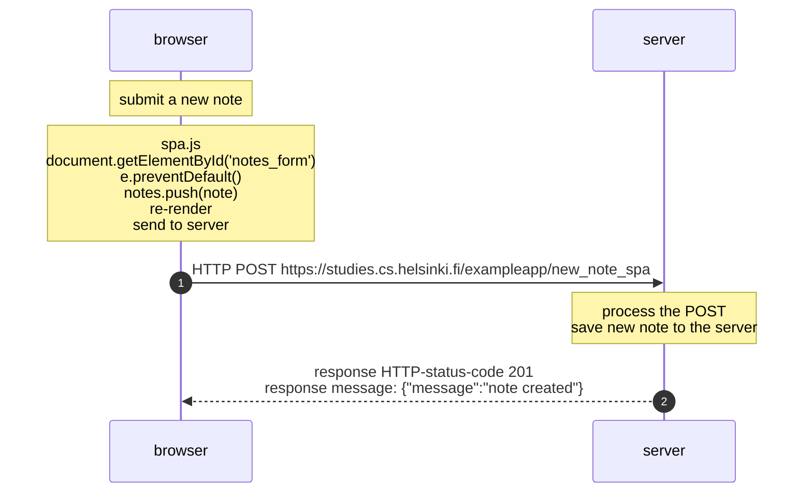

# Exercise 6

## when create new note in spa

```mermaid
sequenceDiagram

	autonumber

	participant browser
	participant server

	Note over browser: submit a new note

	Note over browser: spa.js <br> document.getElementById('notes_form') <br> e.preventDefault() <br> notes.push(note) <br> re-render <br> send to server
	browser ->> server: HTTP POST https://studies.cs.helsinki.fi/exampleapp/new_note_spa

	Note over server: process the POST <br> save new note to the server

	server -->> browser: response HTTP-status-code 201 <br> response message: {"message":"note created"}


```
