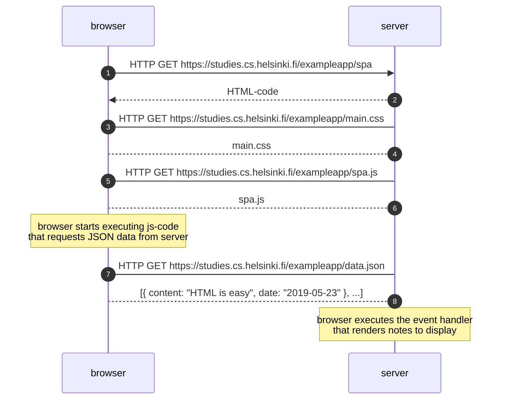

# Exercise 5

## when enter 

```mermaid
sequenceDiagram
	participant browser
	participant server

	autonumber

	browser ->> server: HTTP GET https://studies.cs.helsinki.fi/exampleapp/spa
	server -->> browser: HTML-code
	browser->server: HTTP GET https://studies.cs.helsinki.fi/exampleapp/main.css
	server-->browser: main.css
	browser->server: HTTP GET https://studies.cs.helsinki.fi/exampleapp/spa.js
	server-->browser: spa.js

	Note over browser:browser starts executing js-code <br>  that requests JSON data from server

	browser->server: HTTP GET https://studies.cs.helsinki.fi/exampleapp/data.json
	server-->browser: [{ content: "HTML is easy", date: "2019-05-23" }, ...]

	Note over server: browser executes the event handler <br> that renders notes to display
```
